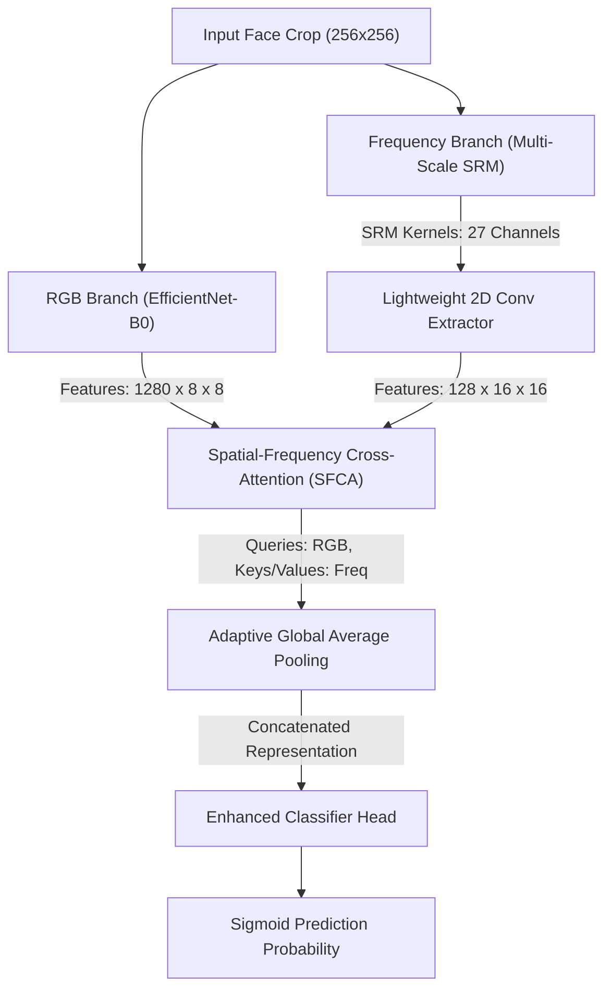

# Deepfake Detection Robustness Benchmarking for Social-Media Content Moderation

[-blue.svg)](https://www.utn.de/)
[](https://www.python.org/)
[](https://pytorch.org/)
[](model.py)
[](LICENSE)

> **Empirical Benchmarking and Mitigation Framework for Lightweight Deepfake Detectors under Lossy Social-Media Transformations**
> *Developed at the University of Technology Nuremberg (UTN)*

---

## 📌 Executive Summary

Lightweight Convolutional Neural Networks (CNNs) like **EfficientNet-B0** offer high computational efficiency (~3.65 ms/frame inference), making them ideal for real-time video content moderation in high-throughput social-media pipelines. However, standard deepfake detection architectures are usually trained on pristine, high-resolution datasets.

When media is uploaded to platforms like WhatsApp, Telegram, or Facebook, it undergoes aggressive **lossy JPEG compression, spatial downscaling, and blurs**. These operations severely attenuate the high-frequency spatial artifacts that deepfake detectors rely on.

This project delivers a statistically rigorous benchmarking framework designed to:
1. **Quantify Performance Drop**: Measure how severely social media compressions degrade discrimination power (ROC-AUC) and calibration (ECE).
2. **Implement Robust Mitigation**: Use a Dual-Branch Spatial-Frequency Cross-Attention architecture and robustness-aware training (Mixup, curriculum ramping, and forensic augmentations) to recover performance on degraded media without sacrificing speed.

---

## 🧠 Architecture: Dual-Branch Spatial-Frequency Fusion

Our model ([`model.py`](model.py)) couples spatial RGB representation learning with high-frequency residual noise analysis via a **Spatial-Frequency Cross-Attention (SFCA)** mechanism.



---

## 🚀 Execution Guide & Command Reference

### 1. Environment Setup
Tested and CI-supported on **Python 3.10–3.12** (CI pins 3.11). Python 3.13+ is installable
(`requirements.txt` uses version markers to select compatible torch/torchvision/Pillow builds)
but is not exhaustively tested by this project.
```bash
pip install -r requirements.txt
```

### 2. Dataset Acquisition
Download the FaceForensics++ video sequences (`c23` compression tier):
```bash
python -m src.datasets.download-FaceForensics datasets/FaceForensics -t videos
```
*(Optionally, use `python -m src.datasets.download_celebdf` to download the Celeb-DF v2 dataset for cross-dataset generalization testing).*

### 3. Face Extraction & Group Stratification
Extract aligned 256x256 face crops with MTCNN and zero-leakage group assignment.
*(Pass `--sanity` to run a fast extraction on a small (up to ~16-video) debugging sample. It
fails fast with an actionable error, before running face extraction, if the sampled videos'
source identities happen to connect into too few independent groups to form a leakage-free
split — see "Strict Leakage Enforcement" below).*
```bash
python -m src.datasets.extract_faces
```

### 4. Model Training
**Train Standard Baseline Model (Clean Data):**
```bash
python -m src.training.train --model efficientnet_b0 --strategy clean --epochs 30 --batch_size 32
```

**Train Robustness-Aware Model (Degradation Augmentations):**
```bash
python -m src.training.train --model efficientnet_b0 --strategy degradation --epochs 30 --batch_size 32
```

### 5. Comparative Evaluation Benchmark
Run the complete 15-tier benchmark suite (Bootstrap CI, ROC-AUC, ECE):
```bash
python -m src.evaluation.evaluate --mode comparative --bootstraps 1000
```
*(To monitor training live, use: `tensorboard --logdir=deepfake_robustness/outputs/runs`)*

### 6. Grad-CAM Interpretability

Grad-CAM (`gradcam.py`) is a **secondary, inference-only** interpretability layer on top of
already-trained checkpoints. It does not affect training, the model architecture, the
train/val/test split, or the main quantitative robustness metrics in any way.

**Single image, single model:**
```bash
python -m src.evaluation.gradcam \
  --checkpoint deepfake_robustness/outputs/efficientnet_b0_clean/best_model.pt \
  --image path/to/face.jpg \
  --output deepfake_robustness/outputs/gradcam_example.png
```
Produces `Original face | Grad-CAM heatmap | Heatmap overlay` plus a JSON metadata sidecar
(`gradcam_example.json`) recording the checkpoint, model variant, degradation, predicted class,
fake probability, threshold, and target layer used.

**Clean vs. degraded comparison (same model):**
```bash
python -m src.evaluation.gradcam --checkpoint <ckpt.pt> --image <face.jpg> --output <out.png> \
  --degradation strong_compression --compare-degradation
```

**Standard vs. robustness-aware model comparison (same input):**
```bash
python -m src.evaluation.gradcam --checkpoint <clean_ckpt.pt> --compare-checkpoint <degradation_ckpt.pt> \
  --image <face.jpg> --output <out.png> [--degradation resize_50_compress_70]
```

Other flags: `--branch {rgb,freq}` (RGB backbone vs. the MS-SRM frequency branch, when the
checkpoint's architecture has one) and `--target-class {predicted,fake,real}` (which score to
backpropagate from; see `gradcam.py`'s module docstring for how this is derived from the
model's single pre-sigmoid logit).

**Methodological caution:** Grad-CAM shows which regions influenced the model's output score -
it does **not** prove the model located the true manipulation region, and a heatmap is not a
segmentation mask. It is a qualitative, exploratory diagnostic and must not replace or be
conflated with the quantitative robustness evaluation above (ROC-AUC/ECE/bootstrap CIs).
Heatmap comparisons across degradation tiers or model checkpoints are exploratory; the optional
`compare_gradcam_maps()` similarity numbers (cosine similarity / Pearson correlation / windowed
SSIM) are descriptive aids for a single image pair, not a statistical claim. See the full
discussion in `gradcam.py`'s module docstring.

---

## 📊 Empirical Benchmarking Matrix

Evaluated across **15 distinct degradation tiers**. Statistical validity is enforced using **95% Non-parametric Percentile Bootstrap Confidence Intervals** and **Paired Bootstrap Hypothesis Testing**.

> **Note:** Run `evaluate.py --mode comparative` to auto-generate and populate this matrix locally inside `deepfake_robustness/outputs/comparative_robustness_report.md`.

| Degradation Tier | Standard ROC-AUC (95% CI) | Robustness ROC-AUC (95% CI) | $\Delta$ ROC-AUC |
| :--- | :---: | :---: | :---: |
| `clean` | *[TBD]* | *[TBD]* | *[TBD]* |
| `weak_compression` ($Q=90$) | *[TBD]* | *[TBD]* | *[TBD]* |
| `extreme_compression` ($Q=30$) | *[TBD]* | *[TBD]* | *[TBD]* |
| `resize_25` ($0.25\times$) | *[TBD]* | *[TBD]* | *[TBD]* |
| `gaussian_blur` | *[TBD]* | *[TBD]* | *[TBD]* |
| `social_media_pipeline` | *[TBD]* | *[TBD]* | *[TBD]* |

---

## 🛡️ Methodological Protocols & Leakage Prevention

1. **Group-Level Video Stratification**: Strict group-based splitting ([`dataset.py`](dataset.py)) ensures frames from the same source video never span across Train/Val/Test sets.
2. **Strict Leakage Enforcement**: `assign_group_splits` never reuses a source-video group across train/val/test. If there are too few independent groups to form a non-empty, leakage-free three-way split (e.g. an extremely small `--sanity` debugging set), it raises a clear `ValueError` instead of silently overlapping groups — tiny/debugging datasets should pre-assign an explicit `split` column rather than relying on automatic group splitting.
3. **Threshold Calibration**: Optimal binary thresholds are calibrated dynamically by sweeping the precision-recall curve and selecting the **F1-maximizing threshold** (`t* = argmax_t F1(t)`) on the validation split.
4. **EMA Stabilization**: Employs Exponential Moving Average (EMA) tracking for both model weights and BatchNorm running statistics.

---

## 📂 Repository Sitemap

```
.
├── src/configs/config.py                            # Central hyperparameters & degradation tier definitions
├── src/models/model.py                             # EfficientNet-B0 Dual-Branch + SFCA
├── src/datasets/dataset.py                           # PyTorch Dataset & zero-leakage manifest handling
├── src/degradations/transforms.py                        # Augmentation pipelines (Standard vs Degradation)
├── src/training/train.py                             # Training engine (AdamW, EMA, Mixup)
├── src/evaluation/evaluate.py                          # 15-tier benchmark matrix evaluation
├── src/evaluation/gradcam.py                           # Grad-CAM interpretability CLI & reusable API
├── src/datasets/extract_faces.py                     # MTCNN extraction & landmark alignment
├── src/evaluation/metrics_utils.py                     # AUC, ECE, & Bootstrap 95% CIs
├── src/datasets/download-FaceForensics.py            # FF++ dataset downloader
├── src/datasets/download_celebdf.py                  # Celeb-DF v2 dataset downloader
├── tests/
│   ├── test_pipeline.py                 # Core pipeline regression tests
│   ├── test_dataset.py                  # Dataset splitting leakage tests
│   ├── test_smoke.py                    # End-to-end synthetic sanity checks
│   └── test_gradcam.py                  # Grad-CAM unit tests (synthetic models/images)
└── .github/workflows/ci.yml             # CI testing pipeline
```

---

## 📝 License and Citation

Distributed under the MIT License. See [`LICENSE`](LICENSE) for details.

```bibtex
@misc{utn_deepfake_robustness_2026,
  author = {University of Technology Nuremberg (UTN)},
  title = {Robustness Benchmarking for Lightweight Deepfake Detection in Social-Media Content Moderation},
  year = {2026},
  url = {https://github.com/sandeep848/comp.vision}
}
```
